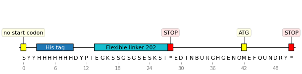

<p align="center">

</p>

# Minotaor

[](https://github.com/Edinburgh-Genome-Foundry/PKGNAME/actions/workflows/build.yml)
[](https://coveralls.io/github/Edinburgh-Genome-Foundry/Minotaor?branch=main)

Minotaor is an a**mino** acid sequence anno**ta**t**or** for quickly identifying common protein tags and linkers in an ORF. Additionally, it can flag peptide motifs that are known to cause problems during translation. It uses Biopython.

## Background

In the [PROSITE](https://prosite.expasy.org/) nomenclature, a sequence *motif* is a description
of the occurrence of amino acids (signature, fingerprint), and can be either a pattern or a profile.
A *pattern* is a qualitative description of a motif in a regular expression-like syntax.
A *profile* (or weight matrix) is a table of position-specific amino acid weights and gap costs.
Many independent binary classifications can be applied to these motifs: *is tag? is linker? is epitope? etc..*

## Install

```bash
pip install minotaor
```

## Usage

```python
import minotaor
from Bio.Seq import Seq
from Bio.SeqRecord import SeqRecord

protein = Seq("SYYHHHHHHHDYPTEGKSSGSGSESKST*EDINBURGHGENQMEFQUNDRY*")
protein_record = SeqRecord(protein, id="example", annotations={"molecule_type": "protein"})

protein_record = minotaor.annotate_record(protein_record)  # search is case sensitive
```

### Plotting

Plotting requires [DNA Features Viewer](https://github.com/Edinburgh-Genome-Foundry/DnaFeaturesViewer) installed:

```python
graphic_record = minotaor.MinotaorTranslator().translate_record(protein_record)
ax, _ = graphic_record.plot(figure_width=10, strand_in_label_threshold=7)
graphic_record.plot_sequence(ax)
```



The annotation classes are colored as follows:

-   Tags
-   Linkers
-   Warnings (potential issues, translation pauses etc.)
-   Errors and stop codons
-   All other classes (protein domain, epitope, CDR3 region, motif etc.)

### Reference datasets

Minotaor can use custom reference pandas dataframes, specified with `seq_dataset`. The `sequence` and `name` columns are used for search and naming of the motifs. This is shown in the below examples of epitope datasets.

#### Immune Epitope Database

Download and unzip a *CSV Metric Export* of your choice from the [IEDB website](https://www.iedb.org/database_export_v3.php), then:

```python
import pandas
iedb_file = 'epitope_full_v3.csv'
iedb = pandas.read_csv(iedb_file, skiprows=1, dtype='str')
iedb.rename(columns={"Epitope IRI": "name", "Description": "sequence"}, inplace=True)
# The dataframe can be used as shown above (note: this is a huge dataset):
protein_record = minotaor.annotate_record(protein_record, seq_dataset=iedb)
```

The epitopes can then be looked up with the link provided as their names. Alternatively,
a more informative epitope name can be constructed from the other columns, as shown in the next section.

#### VDJdb

Download and unzip the latest [VDJdb release](https://github.com/antigenomics/vdjdb-db/releases/latest), then:

```python
import pandas
vdjdb_file = 'vdjdb-YYYY-MM-DD/vdjdb.slim.txt'
vdjdb = pandas.read_csv(vdjdb_file, sep='\t')
# Create a unique subset of the epitopes:
vdjdb_dataset = vdjdb.copy(deep=True)
vdjdb_dataset.drop_duplicates(subset=['antigen.gene'], inplace=True, ignore_index=True)
vdjdb_dataset['sequence'] = vdjdb_dataset['antigen.epitope']  # or 'cdr3' for antibodies
vdjdb_dataset['name'] = ['VDJdb epitope ' + str(antigen)
                         for antigen in vdjdb_dataset['antigen.gene'].to_list()]

protein_record = minotaor.annotate_record(protein_record, seq_dataset=vdjdb_dataset)
```

The motifs then can be looked up in VDJdb for more details.
A similar approach can be used for the McPAS-TCR database.

#### iGEM

Sequences can also be annotated with parts in the Registry of the International Genetically Engineered Machine (iGEM) Foundation. A FASTA of all parts can be downloaded and prepared into a reference dataset as shown in `examples/igem.py`. Alternatively, the [exported MySQL database](http://parts.igem.org/Registry_API) can be prepared in a similar way.

### PROSITE

A function is provided for reading [ScanProsite](https://prosite.expasy.org/scanprosite) results.
Query your sequence with Biopython:

```python
from Bio.ExPASy import ScanProsite
my_seq = 'MYHHHHHHYAGDLPGLMDGAAAGGGA'  # cannot contain '*'
scanprosite_handle = ScanProsite.scan(seq=my_seq, mirror='https://prosite.expasy.org/', output='xml')
scanprosite_record = ScanProsite.read(scanprosite_handle)

protein_record = SeqRecord(Seq(my_seq), id="my_seq", annotations={"molecule_type": "protein"})
protein_record = minotaor.add_scanprosite_results(protein_record, scanprosite_record)
```


#### Conversion

Convert between PROSITE and regex formats:

```python
regex = minotaor.convert_prosite_to_regex("<A-[GV]-{PR}-[FYW](2)-{P}(4)-x-x(8)>.")
regex
# '^A[GV][^PR][FYW]{2}[^P]{4}[^\\*][^\\*]{8}$'
minotaor.convert_regex_to_prosite(regex)
# '<A-[GV]-{PR}-[FYW](2)-{P}(4)-x-x(8)>.'
```

### InterPro

[InterPro](http://www.ebi.ac.uk/interpro/) provides functional analysis of protein sequences, using several databases. We can annotate our protein with the results, as shown below:

```python
import minotaor
from Bio import SearchIO, SeqIO

interpro = SearchIO.read(handle, 'interproscan-xml')  # handle is an InterProScan xml file
seqrecord = SeqIO.read("protein.fasta", "fasta")

seqrecord_annotated = minotaor.add_interpro(seqrecord, interpro, hit_types=['phobius'])
```

### Short linear motifs (SLiMs)

The Eukaryotic Linear Motif (ELM) database is a manually curated collection of experimentally validated SLiMs. The [ELM API](http://elm.eu.org/api/manual.html) returns a tab-separated values (TSV) text file that can be used for annotation:

```python
seqrecord_annotated = minotaor.add_elm_tsv(seqrecord, elm_tsv="elm.tsv")
```

Alternatively, TSV files of the datasets [can be downloaded](http://elm.eu.org/downloads.html) then edited for use with `annotate_record(seqrecord, seq_dataset=`). Note that ELM indexing starts from 1.

### Other

Given a DNA sequence, return amino acid sequences that may contain it:

```python
bsmbi_site = "CGTCTC"
print(minotaor.convert_dna_to_aa_pattern(bsmbi_site))
# ['RL', '[DATRSICYNLFPHVG]V[S]', '[SPAT]S[RPLQH]', 'ET', '[MAT*RSPKLEVQGW]R[R]', '[G*R]D[DAVEG]']
```

Returns a regex for each of the 6 translation frames. Note that the search with regex is case sensitive.

Compute % content of selected amino acids:

```python
minotaor.add_aa_content(seqrecord, aa=["D", "E"], window_size=10, cutoff=0.3, name="Acidic sequence"):
```

Useful for finding proline-rich (P) or acidic sequences (D/E) that may interfere with translation.

## Versioning

Minotaor uses the [semantic versioning](https://semver.org) scheme.

## License = MIT

Minotaor is [free software](https://www.gnu.org/philosophy/free-sw.en.html), which means
the users have the freedom to run, copy, distribute, study, change and improve the software.

Minotaor was written at the [Edinburgh Genome Foundry](https://edinburgh-genome-foundry.github.io/)
by [Peter Vegh](https://github.com/veghp) and is released under the MIT license.
